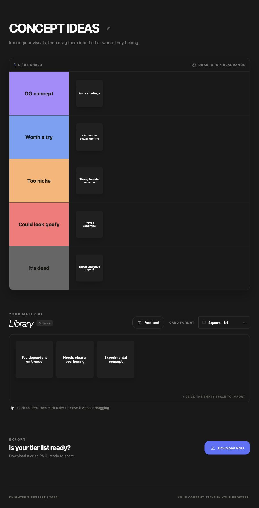

# Knighter Tiers List

Application web autonome permettant d’importer des images ou de créer des blocs texte, de les classer dans une tier list et d’exporter le résultat en PNG.

Le projet fonctionne entièrement dans le navigateur, sans framework, sans base de données et sans envoi d’images vers un serveur.

## Site en production

[https://knighter-tierslist.vercel.app/](https://knighter-tierslist.vercel.app/)

## Aperçu de l’interface



## Lancer le projet

Prérequis : Python 3 et npm.

```bash
cd tier-list-maker
npm run dev
```

Ouvrir ensuite [http://localhost:4173](http://localhost:4173).

## Utilisation

1. Cliquez dans la bibliothèque ou déposez-y des fichiers. Utilisez **Add text** pour créer un bloc texte.
   Une liste numérotée collée dans la fenêtre crée automatiquement un bloc par point de premier niveau.
2. Choisissez le format des vignettes : carré, portrait ou paysage.
3. Faites glisser les images et les blocs texte dans les catégories de la tier list.
4. Pour déplacer un élément sans le faire glisser, cliquez dessus puis cliquez sur la catégorie souhaitée.
5. Modifiez le titre ou les noms des catégories directement dans l’interface.
6. Cliquez sur **Download PNG** en bas de la page pour exporter le classement.

## Fonctionnalités

- Import multiple de fichiers JPG, PNG et WEBP
- Création de blocs texte classables comme les images
- Conversion automatique des listes numérotées en plusieurs blocs texte
- Conservation des sous-points indentés dans le bloc de leur point parent
- Taille de texte adaptative lorsque le contenu est long
- Import par clic, glisser-déposer ou collage depuis le presse-papiers
- Bibliothèque avec état vide automatique
- Formats carré `1:1`, portrait `4:5` et paysage `16:9`
- Glisser-déposer optimisé pour la souris, le trackpad et le tactile
- Sélection alternative au clic
- Titre et catégories modifiables
- Retour automatique sur plusieurs lignes
- Redimensionnement des vignettes pour conserver une hauteur fixe par catégorie
- Retour dans la bibliothèque ou suppression individuelle des éléments
- Interface responsive
- Export PNG local en haute résolution
- Export avec taille de carte fixe et hauteur de catégorie adaptative

## Export PNG

Le fichier exporté mesure `1600 px` de large. Sa hauteur s’adapte au nombre de rangées nécessaires dans chaque catégorie afin que les images et les blocs texte conservent une taille fixe et lisible.

Il contient :

- Le titre de la tier list
- Les cinq catégories et leurs couleurs
- Toutes les images et tous les blocs texte classés
- Le ratio actuellement sélectionné
- La mention de confidentialité Knighter Tiers List

Les éléments encore présents dans la bibliothèque ne sont pas inclus dans l’export.

## Design system

- Typographie : SF Pro Display et SF Pro Text
- Fond principal : `#191919`
- Fond des blocs texte : `#202020`, sans contour au repos
- Accent interactif : `#5d71fc`
- Bouton d’édition du titre sans contour, avec retour visuel au survol
- Palette des catégories issue du projet de positionnement
- Contours bleus au survol et à la sélection

## Structure

```text
tier-list-maker/
├── index.html     # Structure de l’interface
├── styles.css     # Design system et responsive
├── app.js         # Import, classement, interactions et export PNG
├── package.json   # Commandes de lancement
└── README.md      # Documentation
```

## Confidentialité

Les fichiers importés sont lus avec les API locales du navigateur. Ils ne quittent pas l’appareil et ne sont transmis à aucun service externe.

Le rechargement de la page réinitialise la tier list actuelle.
